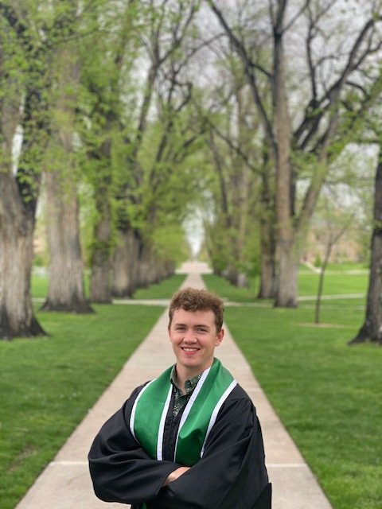
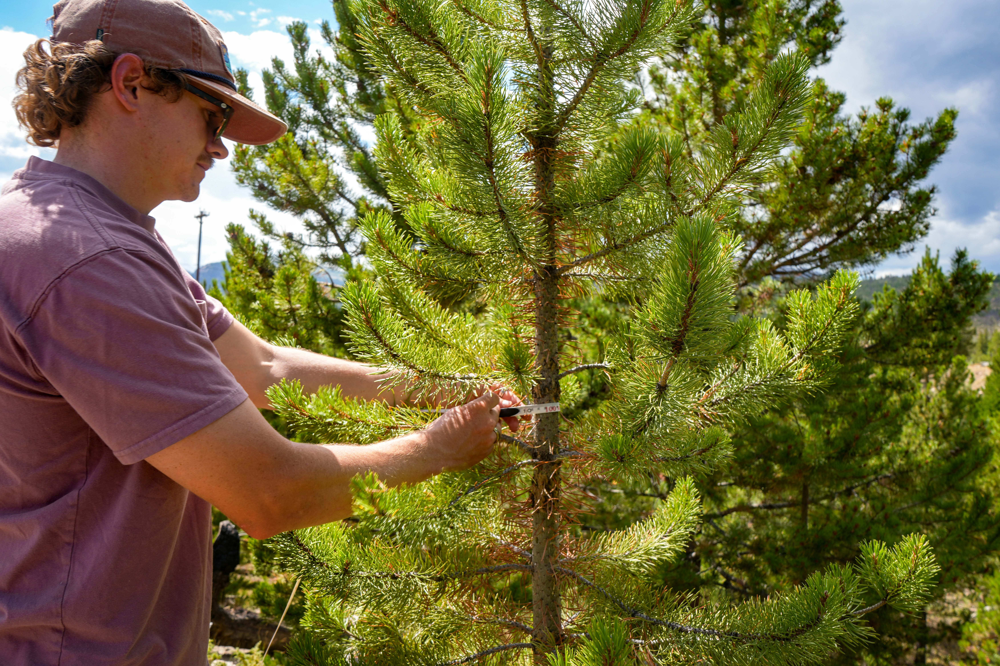
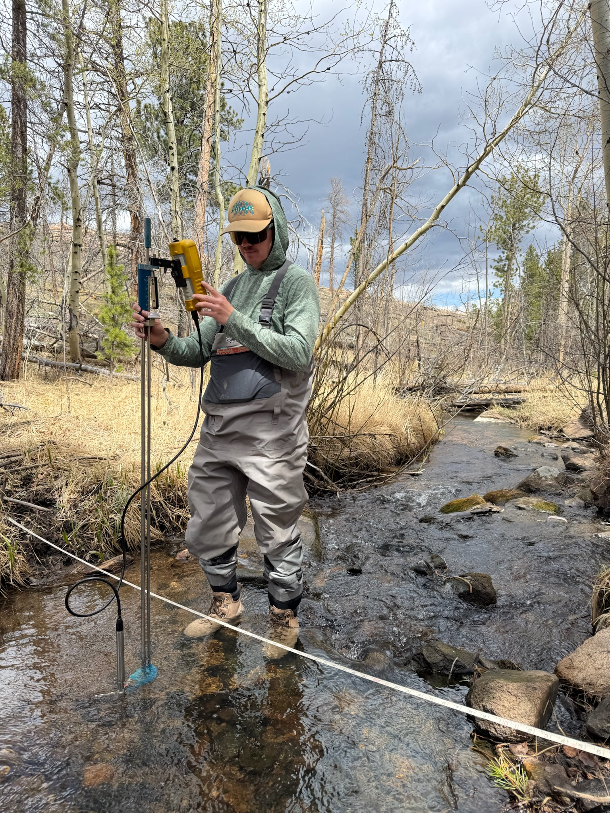

{width="200px" style="border-radius: 50%;"}

Hi, I’m Kyle. I’ve always been drawn to the places where people, landscapes, and science overlap. Growing up with a love for the outdoors, I found myself happiest exploring rivers, mountains, and the ecosystems that connect them. That interest eventually guided my academic and professional path from computer science and IT to hands-on fieldwork, outdoor leadership, and now graduate study in Ecosystem Science and Sustainability.

I’m especially passionate about watershed science, water quality, and understanding how ecological processes shape the world we depend on. Whether I’m rafting down the Animas, snowboarding in the San Juans, or working on local conservation projects, I’m constantly inspired by the natural systems I get to study and explore. These experiences motivate me to help protect water resources and support resilient communities in the West.

My work blends analytical thinking with field experience: using data modeling, GIS, and problem-solving to make sense of complex environmental issues, while staying connected to the landscapes I care about through outdoor work and recreation. I’m excited to build a career in water resources, hydrology, or watershed management where I can combine science, technology, and an appreciation for nature.

Outside of school and work, you’ll usually find me snowboarding, rafting, hiking with my dog Summit, or discovering new corners of the Southwest’s diverse ecosystems.

[Download My Résumé](ROSS_Resume.pdf){.btn .btn-primary}

