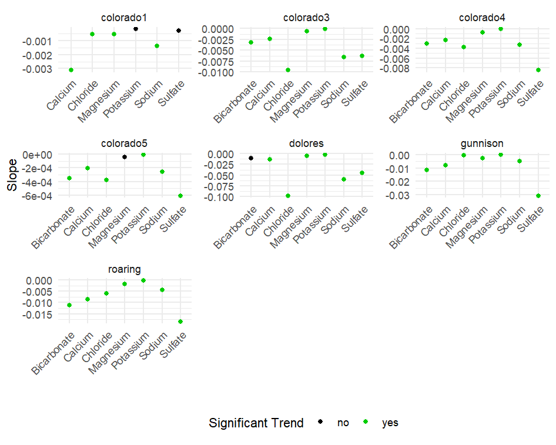

## Significant relationships between discharge and ion concentration

-    Strengthened R and data analysis skills through cleaning, visualizing, and modeling environmental data.

-   Gained hands-on experience with hydrology and water quality processes, connecting model outputs to real-world management questions.

-   Improved technical communication by summarizing results in clear visuals and narratives for broader audiences.
