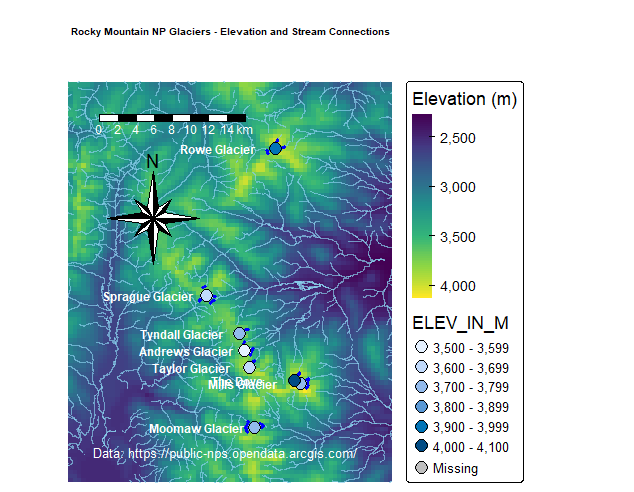

## Rocky Mountain NP Glacier & Stream Connectivity Map

-    Built core GIS skills including data cleaning, layer management, and map design.

-   Translated ecological information into clear visual communication, improving my ability to present spatial insights.

-   Developed reliable project workflows, including sourcing quality data and documenting the process for reproducibility.
